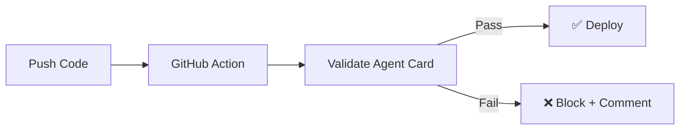

# Step 1: Introduction

In this quickstart, you'll learn how to automate A2A agent validation in your CI/CD pipeline using the CapiscIO GitHub Action.

---

## What You'll Build

By the end, you'll have:

- Automatic validation on every push
- PR comments with validation results
- Deployment blocking for non-compliant agents

---

## Prerequisites

Before starting, ensure you have:

| Requirement | Check |
|-------------|-------|
| GitHub repository | With push access |
| An `agent-card.json` | In your repo |
| Basic GitHub Actions knowledge | Helpful but not required |
| ~5 minutes | ☕ |

---

## Why Automate Validation?

| Problem | Solution |
|---------|----------|
| "It worked on my machine" | Consistent validation in CI |
| Manual validation forgotten | Automatic on every change |
| Non-compliant deploys | Block before merge |
| Review burden | Automated comments with results |

---

## The validate-a2a Action

The `capiscio/validate-a2a` action:

- **Downloads** the CapiscIO Core binary
- **Validates** your agent card
- **Reports** scores as outputs
- **Comments** on PRs (optional)
- **Fails** if thresholds not met

### Key Features

| Feature | Description |
|---------|-------------|
| Three-dimensional scoring | Compliance, Trust, Availability |
| Strict mode | Production-ready validation |
| Live testing | Tests actual endpoints |
| JSON output | For custom processing |
| PR comments | Human-readable results |

---

## What You'll Learn

By completing this quickstart, you'll understand:

1. How to add the GitHub Action to your workflow
2. How to configure validation thresholds
3. How to add PR comments with results
4. How to block deployments on failures
5. How to test multiple agent configurations

---

## Time Estimate

| Step | Time |
|------|------|
| Add the Action | 1 min |
| Configure Thresholds | 1 min |
| Add PR Comments | 1 min |
| Test It | 2 min |
| **Total** | **~5 min** |

---

## Ready?

Let's automate your agent validation!

[Continue :material-arrow-right:](2-action.md){ .md-button .md-button--primary }

