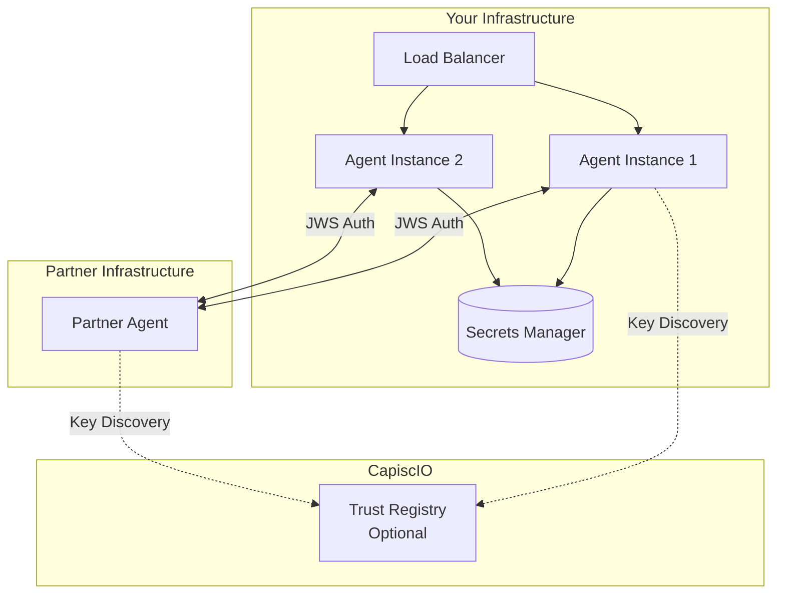

# Step 5: Go to Production

You've tested SimpleGuard in development mode. Now let's prepare for production deployment.

---

## Production Checklist

Before deploying, ensure you've completed these steps:

- [ ] Generate production keys (not dev-mode auto-generated)
- [ ] Create a proper `agent-card.json`
- [ ] Set up your trust store with real partners
- [ ] Disable `dev_mode`
- [ ] Set `CAPISCIO_ENV=prod`

---

## Step 1: Generate Production Keys

Use the CapiscIO CLI to generate proper Ed25519 keys:

```bash
# Install CLI if you haven't
pip install capiscio

# Generate keys
capiscio key gen --out-priv capiscio_keys/private.jwk --out-pub capiscio_keys/public.jwk
```

Output:
```
✅ Private Key saved to capiscio_keys/private.jwk
✅ Public Key saved to capiscio_keys/public.jwk
```

!!! danger "Protect Your Private Key"
    - Never commit `private.jwk` to version control
    - Add `capiscio_keys/private.jwk` to `.gitignore`
    - Use secrets management in production (e.g., AWS Secrets Manager, HashiCorp Vault)

---

## Step 2: Create Production Agent Card

Create a proper `agent-card.json`:

```json title="agent-card.json"
{
  "agent_id": "did:capiscio:agent:my-company:production-agent",
  "name": "My Production Agent",
  "description": "Production A2A agent for My Company",
  "url": "https://agent.mycompany.com",
  "version": "1.0.0",
  "protocolVersion": "0.2.0",
  "provider": {
    "organization": "My Company Inc.",
    "url": "https://mycompany.com"
  },
  "capabilities": {
    "streaming": false,
    "pushNotifications": false
  },
  "public_keys": [
    {
      "kty": "OKP",
      "crv": "Ed25519",
      "x": "<base64-encoded-public-key-from-jwk>",
      "kid": "prod-key-2024-01",
      "use": "sig"
    }
  ],
  "skills": [
    {
      "id": "customer-support",
      "name": "Customer Support",
      "description": "Handles customer support inquiries",
      "tags": ["support", "customer-service"]
    }
  ],
  "authentication": {
    "schemes": ["capiscio-jws"]
  }
}
```

---

## Step 3: Configure Trust Store

Add public keys of agents you trust:

```bash
# Create trust store directory
mkdir -p capiscio_keys/trusted

# Add partner agent keys (get these from your partners)
cp partner-agent-public.pem capiscio_keys/trusted/partner-key-id.pem
```

### Getting Partner Keys

Ask your integration partners for their:

1. **Agent Card URL**: `https://partner.com/.well-known/agent-card.json`
2. **Public Key**: Extract from their agent card's `public_keys` array

You can fetch and save partner keys:

```python
import httpx
import json
import base64
from pathlib import Path

def trust_partner(agent_card_url: str, trust_dir: str = "capiscio_keys/trusted"):
    """Fetch an agent card and add its public key to our trust store."""
    
    # Fetch the agent card
    response = httpx.get(agent_card_url)
    card = response.json()
    
    for key in card.get("public_keys", []):
        kid = key.get("kid")
        x = key.get("x")
        
        if not kid or not x:
            continue
        
        # Convert JWK to PEM format
        # (In production, use a proper JWK library)
        print(f"Trusting key: {kid}")
        
        # Save as PEM (simplified - use proper conversion in production)
        # This is a placeholder - real implementation needs proper JWK→PEM conversion
        
    print(f"Added trust for agent: {card.get('name')}")

# Usage:
# trust_partner("https://partner-agent.com/.well-known/agent-card.json")
```

---

## Step 4: Update Your Code

Remove `dev_mode=True`:

```python title="main.py" hl_lines="7"
from fastapi import FastAPI, Request, HTTPException
from fastapi.responses import JSONResponse
from capiscio_sdk import SimpleGuard

app = FastAPI(title="My Production Agent")

guard = SimpleGuard()  # No dev_mode! Uses existing keys.

# ... rest of your code
```

---

## Step 5: Set Environment Variables

```bash
# Tell SimpleGuard we're in production
export CAPISCIO_ENV=prod

# Start your application
python main.py
```

Or in Docker:

```dockerfile
FROM python:3.11-slim

ENV CAPISCIO_ENV=prod

WORKDIR /app
COPY . .
RUN pip install -r requirements.txt

# Mount secrets at runtime
# capiscio_keys/private.jwk should come from secrets management

CMD ["python", "main.py"]
```

---

## Production Architecture



---

## Key Rotation

Periodically rotate your keys:

1. Generate new key pair
2. Update `agent-card.json` with new public key
3. Notify partners of the new key
4. Keep old key trusted for transition period
5. Remove old key after transition

```bash
# Generate new key with dated ID
capiscio key gen \
  --out-priv capiscio_keys/private-2024-02.jwk \
  --out-pub capiscio_keys/public-2024-02.jwk
```

---

## Monitoring in Production

Add structured logging:

```python
import logging
import json

# Configure JSON logging
class JsonFormatter(logging.Formatter):
    def format(self, record):
        return json.dumps({
            "timestamp": self.formatTime(record),
            "level": record.levelname,
            "message": record.getMessage(),
            "logger": record.name
        })

handler = logging.StreamHandler()
handler.setFormatter(JsonFormatter())
logging.getLogger("capiscio_sdk").addHandler(handler)
```

### Metrics to Track

| Metric | Description | Alert Threshold |
|--------|-------------|-----------------|
| `auth_success_rate` | % of successful authentications | < 99% |
| `auth_failures` | Count of failed authentications | > 100/min |
| `untrusted_key_attempts` | Unknown keys trying to connect | > 10/min |
| `signature_verification_time` | Time to verify signatures | > 100ms p99 |

---

## Security Best Practices

1. **Rotate keys regularly** (every 90 days recommended)
2. **Use secrets management** for private keys
3. **Monitor authentication failures** for attacks
4. **Keep trust store minimal** - only trust who you need
5. **Validate agent cards** of partners before trusting
6. **Use TLS everywhere** (JWS doesn't replace HTTPS)

---

## What You've Accomplished

Congratulations! :tada: You've completed the Security Quickstart!

- [x] Installed the CapiscIO Python SDK
- [x] Configured SimpleGuard
- [x] Signed and verified requests
- [x] Tested all security scenarios
- [x] Prepared for production deployment

---

## Next Steps

<div class="grid cards" markdown>

-   :material-check-circle:{ .lg .middle } **Validate Your Agent**

    ---

    Ensure your agent card passes all compliance checks.

    [:octicons-arrow-right-24: Validation Quickstart](../validate/1-intro.md)

-   :material-github:{ .lg .middle } **Automate with CI/CD**

    ---

    Add validation to your deployment pipeline.

    [:octicons-arrow-right-24: CI/CD Quickstart](../cicd/1-intro.md)

-   :material-book-open:{ .lg .middle } **Deep Dive: Trust Model**

    ---

    Understand how CapiscIO's trust model works.

    [:octicons-arrow-right-24: Trust Model](../../concepts/trust-model.md)

-   :material-code-braces:{ .lg .middle } **SDK Reference**

    ---

    Complete SimpleGuard API documentation.

    [:octicons-arrow-right-24: SDK Reference](../../reference/sdk-python/simple-guard.md)

</div>

---

**Thank you for completing the Security Quickstart!** :rocket:

<div class="nav-buttons" markdown>
[:material-arrow-left: Back](4-test.md){ .md-button }
[:material-home: Quickstarts](../index.md){ .md-button .md-button--primary }
</div>
