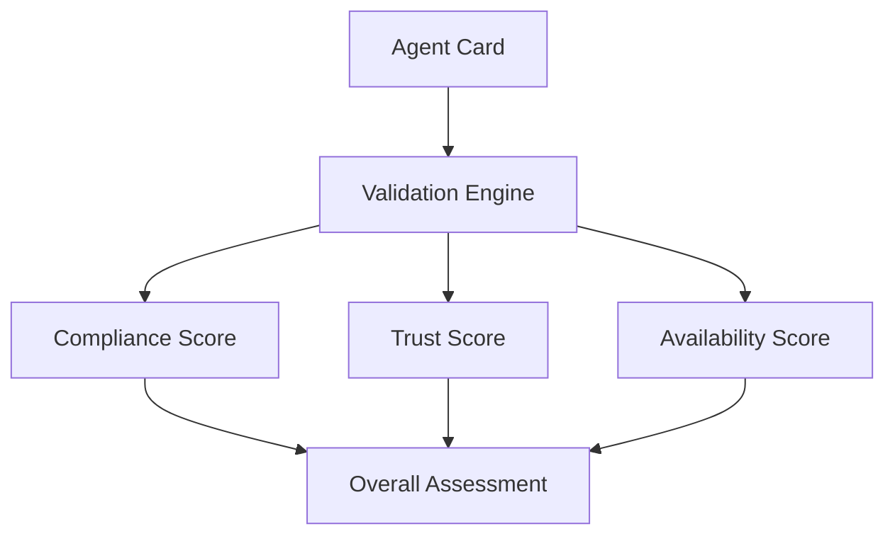

# Step 4: Understanding Reports

CapiscIO uses a **three-dimensional scoring system** to give you a complete picture of your agent's health. Let's understand what each score means.

---

## The Three Dimensions



| Dimension | What It Measures | Range |
|-----------|------------------|-------|
| **Compliance** | Does the agent follow the A2A spec? | 0-100 |
| **Trust** | Is the agent cryptographically verified? | 0-100 |
| **Availability** | Does the endpoint respond correctly? | 0-100 |

---

## Compliance Score

The **Compliance Score** measures how well your agent card follows the A2A protocol specification.

### What's Checked

| Check | Impact |
|-------|--------|
| Required fields present | High |
| Correct field types | High |
| Valid protocol version | High |
| Valid URLs | Medium |
| Skills properly defined | Medium |
| Optional fields present | Low |

### Improving Your Score

Our sample agent card scores 75/100. Let's improve it:

```json title="agent-card.json (improved)"
{
  "name": "My First Agent",
  "description": "A sample A2A agent for learning CapiscIO",
  "url": "https://example.com/agent",
  "version": "1.0.0",
  "protocolVersion": "0.2.0",
  "provider": {
    "organization": "My Company",
    "url": "https://mycompany.com"
  },
  "capabilities": {
    "streaming": false,
    "pushNotifications": false,
    "stateTransitionHistory": false
  },
  "skills": [
    {
      "id": "greeting",
      "name": "Greeting",
      "description": "Returns a friendly greeting",
      "tags": ["communication", "social"],
      "examples": ["Say hello", "Greet the user"]
    }
  ],
  "authentication": {
    "schemes": ["none"]
  }
}
```

Re-run validation:

=== "Command"

    ```bash
    capiscio validate agent-card.json
    ```

=== "Output"

    ```ansi
    ✅ A2A AGENT VALIDATION PASSED

    ┌───────────────────────────────────────┐
    │  Compliance Score:  95/100            │
    │  Trust Score:       0/100 (unsigned)  │
    │  Availability:      N/A               │
    └───────────────────────────────────────┘

    ✓ All required fields present
    ✓ Protocol version valid
    ✓ Skills properly defined
    ✓ Provider information complete
    ✓ Authentication scheme specified

    📊 Improvements:
      +20 points from adding provider info
      + 5 points from adding skill examples
    ```

Score improved from 75 to 95!

---

## Trust Score

The **Trust Score** measures cryptographic verification of the agent's identity.

### What's Checked

| Check | Impact |
|-------|--------|
| JWS signature present | High |
| Signature is valid | High |
| Key ID (kid) matches | High |
| Key is not revoked | High |
| Issuer is trusted | Medium |

### Without Signatures

Without a JWS signature, your trust score will be **0**:

=== "Command"

    ```bash
    capiscio validate agent-card.json
    ```

=== "Output"

    ```ansi
    ⚠️  Trust Score: 0/100

    TRUST WARNINGS:
      ⚠️  UNSIGNED_CARD: Agent card is not signed
      ⚠️  NO_KEY_ID: No key ID (kid) found

    💡 To sign your agent card, see the Security Quickstart
    ```

### With Signatures

To get a trust score, your agent card needs to be signed. We'll cover this in the [Security Quickstart](../secure/1-intro.md).

For now, if you're just validating (not deploying to production), you can skip signature verification:

```bash
capiscio validate agent-card.json --skip-signature
```

---

## Availability Score

The **Availability Score** measures whether your agent's endpoint is reachable and responds correctly.

### What's Checked

| Check | Impact |
|-------|--------|
| Endpoint reachable | High |
| Returns valid JSON | High |
| Responds within timeout | Medium |
| Correct content-type | Low |

### Testing Availability

Use `--test-live` to test a real endpoint:

=== "Command"

    ```bash
    capiscio validate https://real-agent.example.com/agent-card.json --test-live
    ```

=== "Output (Success)"

    ```ansi
    ✅ LIVE ENDPOINT TEST

    ┌───────────────────────────────────────┐
    │  Availability Score:  100/100         │
    └───────────────────────────────────────┘

    ✓ Endpoint reachable (245ms)
    ✓ Valid JSON response
    ✓ Correct content-type: application/json
    ✓ A2A protocol response verified
    ```

=== "Output (Failure)"

    ```ansi
    ❌ LIVE ENDPOINT TEST FAILED

    ┌───────────────────────────────────────┐
    │  Availability Score:  0/100           │
    └───────────────────────────────────────┘

    ❌ Endpoint unreachable: connection timeout
    💡 Verify the URL is correct and accessible
    ```

This sends an actual A2A message to the agent and verifies the response.

!!! tip "For Development"
    During development, use `--schema-only` to skip endpoint testing:
    
    ```bash
    capiscio validate agent-card.json --schema-only
    ```

---

## Production Readiness

CapiscIO determines if your agent is **production ready** based on these thresholds:

| Dimension | Threshold |
|-----------|-----------|
| Compliance | ≥ 95 |
| Trust | ≥ 60 |
| Availability | ≥ 80 |

Check production readiness in JSON output:

```bash
capiscio validate agent-card.json --json | jq '.scoringResult.productionReady'
```

Or use strict mode (which enforces these thresholds):

=== "Command"

    ```bash
    capiscio validate agent-card.json --strict
    ```

=== "Output (Ready)"

    ```ansi
    ✅ PRODUCTION READY

    ┌───────────────────────────────────────┐
    │  Compliance:    98/100  ✓ (≥95)       │
    │  Trust:         85/100  ✓ (≥60)       │
    │  Availability:  95/100  ✓ (≥80)       │
    └───────────────────────────────────────┘

    🚀 Agent is production ready!
    ```

=== "Output (Not Ready)"

    ```ansi
    ❌ NOT PRODUCTION READY

    ┌───────────────────────────────────────┐
    │  Compliance:    75/100  ❌ (need ≥95) │
    │  Trust:          0/100  ❌ (need ≥60) │
    │  Availability:  N/A                   │
    └───────────────────────────────────────┘

    ⚠️  Issues to fix:
      - Add missing optional fields for compliance
      - Sign agent card for trust verification

    Exit code: 1
    ```

---

## Issue Severity Levels

When issues are found, they have severity levels:

| Level | Icon | Meaning | Strict Mode |
|-------|------|---------|-------------|
| Error | ❌ | Must fix | Fails validation |
| Warning | ⚠️ | Should fix | Fails validation |
| Info | ℹ️ | Nice to know | Passes |

### Common Issues and Fixes

| Code | Issue | Fix |
|------|-------|-----|
| `MISSING_REQUIRED_FIELD` | Required field missing | Add the field |
| `INVALID_URL` | URL format is wrong | Check URL syntax |
| `VERSION_MISMATCH` | Protocol version unsupported | Update `protocolVersion` |
| `MISSING_OPTIONAL_FIELD` | Recommended field missing | Add for better compliance |
| `URL_NOT_REACHABLE` | Endpoint unreachable | Check URL or use `--schema-only` |

---

## Reading JSON Reports

For detailed analysis, use JSON output with `jq`:

=== "Get All Scores"

    ```bash
    capiscio validate agent-card.json --json | jq '.scoringResult'
    ```

    ```json
    {
      "complianceScore": 85,
      "trustScore": 0,
      "availabilityScore": null,
      "productionReady": false,
      "overallGrade": "B"
    }
    ```

=== "List All Issues"

    ```bash
    capiscio validate agent-card.json --json | jq '.issues[]'
    ```

    ```json
    {
      "code": "MISSING_OPTIONAL_FIELD",
      "severity": "warning",
      "message": "Missing 'provider.url' field",
      "path": "$.provider.url",
      "suggestion": "Add organization URL for better trust"
    }
    ```

=== "Check Production Ready"

    ```bash
    capiscio validate agent-card.json --json | jq '.scoringResult.productionReady'
    ```

    ```json
    false
    ```

---

## What's Next?

You now understand:

- [x] The three-dimensional scoring system
- [x] What each score measures
- [x] How to interpret issues
- [x] How to improve your scores

Let's wrap up with next steps and resources!

<div class="nav-buttons" markdown>
[:material-arrow-left: Back](3-validate.md){ .md-button }
[Continue :material-arrow-right:](5-next.md){ .md-button .md-button--primary }
</div>
