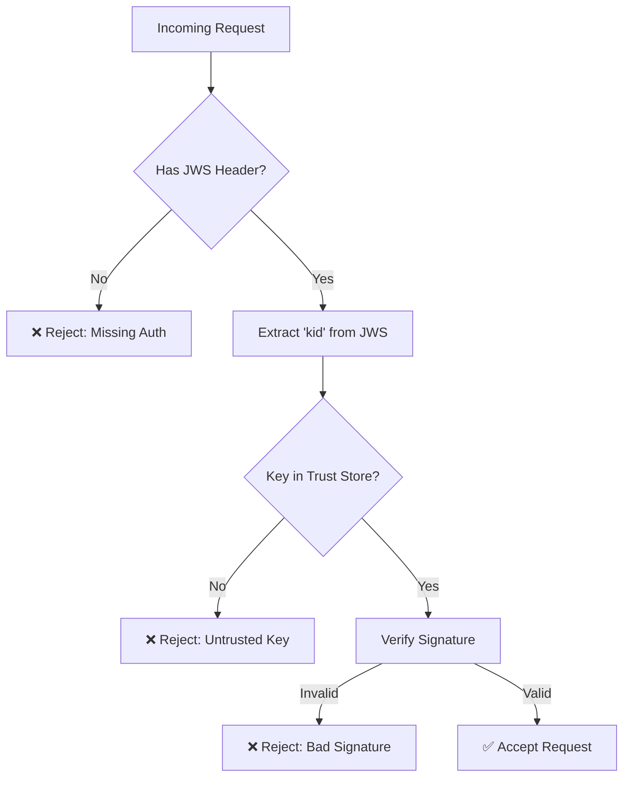

# Trust Store Setup

Configure your trust store to control which agents can communicate with yours.

---

## Problem

You need to:

- Define which agents are trusted to call your agent
- Manage public keys from partners
- Update trust relationships as partners rotate keys
- Reject requests from unknown agents

---

## Solution: File-Based Trust Store

SimpleGuard uses a directory-based trust store:

```
capiscio_keys/
├── private.pem           # Your private key
├── public.pem            # Your public key
└── trusted/              # Trust store directory
    ├── partner-a.pem     # Partner A's public key
    ├── partner-b.pem     # Partner B's public key
    └── partner-c.pem     # Partner C's public key
```

---

## Step 1: Create Trust Store Directory

```bash
mkdir -p capiscio_keys/trusted
```

---

## Step 2: Add Trusted Keys

Get the public key from each partner's agent card and save it:

```bash
# Option 1: Download from agent card URL
curl -s https://partner-a.example.com/.well-known/agent-card.json | \
  jq -r '.public_keys[0]' > capiscio_keys/trusted/partner-a.jwk

# Option 2: Manual copy
# Get the key from partner and save as partner-a.pem
```

### Key File Naming

The filename should match the `kid` (key ID) from the partner's JWS tokens:

```bash
# If partner's JWS header has: "kid": "partner-a-key-2025"
# Save their key as:
capiscio_keys/trusted/partner-a-key-2025.pem
```

---

## Step 3: Configure SimpleGuard

```python
from capiscio_sdk.simple_guard import SimpleGuard

# SimpleGuard finds trust store at capiscio_keys/trusted/ via convention
guard = SimpleGuard()  # dev_mode=False is default

# Or specify a different base directory
guard = SimpleGuard(base_dir="/etc/capiscio")
```

**Expected structure:**
```
base_dir/
├── agent-card.json
└── capiscio_keys/
    ├── private.pem
    ├── public.pem
    └── trusted/          # Trust store
        └── {kid}.pem     # Filename must match key ID
```

---

## Verification Flow

When a request arrives:



---

## Adding a New Partner

### 1. Get Their Agent Card

```bash
curl -s https://new-partner.example.com/.well-known/agent-card.json > /tmp/partner-agent-card.json
```

### 2. Extract Public Key

```bash
# View the public keys
jq '.public_keys' /tmp/partner-agent-card.json

# Extract the first key
jq -r '.public_keys[0]' /tmp/partner-agent-card.json > capiscio_keys/trusted/new-partner.jwk
```

### 3. Verify Before Trusting

```bash
# Validate their agent card first!
capiscio validate https://new-partner.example.com/.well-known/agent-card.json --strict
```

### 4. Restart Your Agent

If using file-based trust store, restart to pick up new keys:

```bash
# Or implement hot-reload in your application
```

---

## Removing Trust

Simply delete the key file:

```bash
rm capiscio_keys/trusted/former-partner.pem
```

Then restart your agent.

---

## Programmatic Trust Store

For dynamic trust management, implement a custom trust store:

```python
from capiscio_sdk.simple_guard import SimpleGuard
from typing import Optional
import httpx

class DynamicTrustStore:
    """Fetch and cache trusted keys from a registry."""
    
    def __init__(self, registry_url: str):
        self.registry_url = registry_url
        self.cache = {}
    
    def get_key(self, kid: str) -> Optional[bytes]:
        """Get public key by key ID."""
        if kid in self.cache:
            return self.cache[kid]
        
        # Fetch from registry
        try:
            response = httpx.get(f"{self.registry_url}/keys/{kid}")
            if response.status_code == 200:
                key = response.content
                self.cache[kid] = key
                return key
        except Exception:
            pass
        
        return None
    
    def is_trusted(self, kid: str) -> bool:
        """Check if a key ID is trusted."""
        return self.get_key(kid) is not None

# Usage with SimpleGuard (conceptual - actual integration depends on SDK version)
trust_store = DynamicTrustStore("https://registry.example.com")
```

---

## Trust Store Patterns

### Pattern 1: Static (Small Networks)

```
trusted/
├── partner-1.pem
├── partner-2.pem
└── partner-3.pem
```

Best for: Small, stable networks with few partners.

### Pattern 2: Environment-Based

```python
import os

# Use CAPISCIO_BASE_DIR to control where SimpleGuard looks for keys
base_dir = os.environ.get("CAPISCIO_BASE_DIR", ".")
guard = SimpleGuard(base_dir=base_dir)
```

```bash
# Development
export CAPISCIO_BASE_DIR=./dev-config/

# Production
export CAPISCIO_BASE_DIR=/etc/capiscio/
```

### Pattern 3: Registry-Based (Large Networks)

```python
# Fetch trusted keys from a central registry
# See DynamicTrustStore example above
```

Best for: Large networks, frequent partner changes.

---

## Security Considerations

| Consideration | Recommendation |
|--------------|----------------|
| Key validation | Always validate agent card before trusting |
| Key rotation | Monitor partners for key rotation announcements |
| Audit logging | Log all trust store changes |
| Backup | Keep backup of trust store |
| Permissions | Restrict write access to trust store directory |

---

## Debugging Trust Issues

### Check if key is in trust store

```bash
ls -la capiscio_keys/trusted/
```

### Verify key format

```bash
# For PEM files
openssl ec -in capiscio_keys/trusted/partner.pem -pubin -text -noout

# For JWK files
cat capiscio_keys/trusted/partner.jwk | jq .
```

### Test signature verification

```python
from capiscio_sdk.simple_guard import SimpleGuard
from capiscio_sdk.errors import VerificationError

guard = SimpleGuard()  # Finds trust store via convention

# Get a signed request from partner and test
try:
    claims = guard.verify_inbound(jws_token, body=body)
    print(f"Verified! Issuer: {claims['iss']}")
except VerificationError as e:
    print(f"Verification failed: {e}")
```

---

## See Also

- [Key Rotation](key-rotation.md) — Rotate your own keys
- [Verify Inbound Requests](verify-inbound.md) — How verification works
- [Security Guide](../../getting-started/secure/1-intro.md) — Full setup guide
