# 🆔 Agent Identity

> **Give your agent a verifiable identity in under 60 seconds — just like Let's Encrypt did for HTTPS.**

## The Problem

AI agents today have an identity crisis:

- **API keys** prove you paid, not who you are
- **OAuth tokens** expire and require constant refresh
- **Hostnames** change when you move providers
- **Self-descriptions** can be forged by anyone

**Result:** No way to know if you're talking to the agent you think you're talking to.

---

## The Solution: One Command Setup

CapiscIO gives every agent a **DID** — a globally unique, cryptographically verifiable identifier:

```
did:key:z6MkhaXgBZDvotDkL5257faiztiGiC2QtKLGpbnnEGta2doK
└───────────────────────────────────────────────────────────┘
              Your agent's permanent identity
```

**Get it with one command:**

=== "CLI"

    ```bash
    export CAPISCIO_API_KEY=sk_live_...
    capiscio init
    ```

=== "Python SDK"

    ```python
    from capiscio_sdk import CapiscIO
    
    agent = CapiscIO.connect(api_key="sk_live_...")
    print(agent.did)  # did:key:z6Mk...
    ```

=== "Environment Variables"

    ```python
    # Set CAPISCIO_API_KEY in your environment
    agent = CapiscIO.from_env()
    ```

This identity:

- ✅ **Proves identity** — Cryptographically signed, unforgeable
- ✅ **Stays with you** — Move providers, keep your identity
- ✅ **Works everywhere** — W3C standard, interoperable
- ✅ **Scales trust** — Link to organizational verification

---

## Choose Your Setup Path

<div class="grid cards" markdown>

-   :material-rocket-launch:{ .lg .middle } **Path 1: Quick Start (Recommended)**

    ---

    Just use your API key. We handle everything.
    
    ```bash
    export CAPISCIO_API_KEY=sk_live_...
    capiscio init
    ```
    
    **Best for:** Getting started fast, single-agent setups.

-   :material-view-dashboard:{ .lg .middle } **Path 2: UI-First**

    ---

    Create your agent in the dashboard first.
    
    ```bash
    # 1. Create agent at app.capisc.io
    # 2. Initialize with specific ID
    capiscio init --agent-id agt_abc123
    ```
    
    **Best for:** Teams, production, multiple agents.

-   :material-laptop:{ .lg .middle } **Path 3: Local Only**

    ---

    Generate keys without server registration.
    
    ```bash
    capiscio init --output-dir .capiscio
    # No API key needed
    ```
    
    **Best for:** Offline dev, testing, self-hosted.

</div>

---

## What You Get

After running `capiscio init`, your `.capiscio/` directory contains:

```
.capiscio/
├── private.jwk      # Ed25519 private key (0600 permissions - keep secret!)
├── public.jwk       # Public key for verification
├── did.txt          # Your agent's did:key identifier
└── agent-card.json  # A2A-compliant agent card with x-capiscio extension
```

---

## How DIDs Work

```mermaid
sequenceDiagram
    participant A as Your Agent
    participant R as CapiscIO Registry
    participant B as Other Agent
    
    Note over A: capiscio init generates keypair
    A->>R: Register DID + public key
    R-->>A: ✅ Identity registered
    
    Note over A,B: Later, when communicating...
    A->>B: Request + JWS signature
    B->>R: Resolve DID → get public key
    R-->>B: DID Document with public key
    B->>B: Verify signature
    Note over B: ✅ Confirmed: really "you"
```



### The DID Document

When someone resolves your DID, they get a **DID Document** containing your public key:

```json
{
  "@context": ["https://www.w3.org/ns/did/v1"],
  "id": "did:key:z6MkhaXgBZDvotDkL5257faiztiGiC2QtKLGpbnnEGta2doK",
  "verificationMethod": [{
    "id": "did:key:z6MkhaXgBZDvotDkL5257faiztiGiC2QtKLGpbnnEGta2doK#keys-1",
    "type": "JsonWebKey2020",
    "controller": "did:key:z6MkhaXgBZDvotDkL5257faiztiGiC2QtKLGpbnnEGta2doK",
    "publicKeyJwk": {
      "kty": "OKP",
      "crv": "Ed25519",
      "x": "..."
    }
  }],
  "authentication": ["...#keys-1"],
  "assertionMethod": ["...#keys-1"]
}
```

This lets anyone verify signatures from your agent **without trusting a central authority**.

---

## DID Methods Compared

| Method | Example | Trust Level | Best For |
|--------|---------|-------------|----------|
| `did:key` | `did:key:z6Mk...` | 0-4 (depends on badge) | All use cases |
| `did:web` | `did:web:yourdomain.com:agent` | 1+ | Self-sovereign hosting |

### Trust Levels

```
Development          Production            Enterprise
───────────          ──────────            ──────────
did:key              did:key               did:key
+ self-signed        + DV badge            + OV/EV badge
     │                    │                      │
     ▼                    ▼                      ▼
Trust Level 0        Trust Level 1-2       Trust Level 3-4
```

---

## Using Your Identity

### Python SDK

```python
from capiscio_sdk import CapiscIO, secure

# Get your identity
agent = CapiscIO.connect(api_key="sk_live_...")

# Use it to secure your agent
secured_agent = secure(MyAgentExecutor())

# Emit events with your identity
agent.emit("task_started", {"task_id": "123"})
```

### CLI

```bash
# View your identity
cat .capiscio/did.txt

# Validate that identity is properly configured
capiscio validate agent-card.json

# Resolve any DID
capiscio identity resolve did:key:z6Mk...
```

---

## Next Steps

<div class="grid cards" markdown>

-   :material-certificate:{ .lg .middle } **Get a Trust Badge**

    ---

    Upgrade from Level 0 to verified trust levels 1-4.

    [:octicons-arrow-right-24: Trust Badges](../trust/index.md)

-   :material-database:{ .lg .middle } **Register in Directory**

    ---

    Make your agent discoverable to others.

    [:octicons-arrow-right-24: Agent Registry](../registry/index.md)

-   :material-rocket-launch:{ .lg .middle } **Getting Started**

    ---

    Complete getting started guide.

    [:octicons-arrow-right-24: Getting Started](../getting-started/index.md)

-   :material-book:{ .lg .middle } **DID Specification**

    ---

    Deep dive into W3C DID standard.

    [:octicons-arrow-right-24: W3C DID Spec](https://www.w3.org/TR/did-core/){:target="_blank"}

</div>
