# 🆔 Agent Identity

> **Give your agent a verifiable identity in under 60 seconds.**

## The Problem

AI agents today have an identity crisis:

- **API keys** prove you paid, not who you are
- **OAuth tokens** expire and require constant refresh
- **Hostnames** change when you move providers
- **Self-descriptions** can be forged by anyone

**Result:** No way to know if you're talking to the agent you think you're talking to.

---

## The Solution: Decentralized Identifiers (DIDs)

CapiscIO gives every agent a **DID** — a globally unique, cryptographically verifiable identifier:

```
did:web:registry.capisc.io:agents:weather-bot-prod
└─────────────────────────────────────────────────┘
              Your agent's permanent identity
```

This DID:

- ✅ **Proves identity** — Cryptographically signed, unforgeable
- ✅ **Stays with you** — Move providers, keep your identity
- ✅ **Works everywhere** — W3C standard, interoperable
- ✅ **Scales trust** — Link to organizational verification

---

## Get Your Agent's Identity in 60 Seconds

=== "Option 1: Self-Signed (Instant)"

    No registration needed. Generate a `did:key` identity locally:
    
    ```bash
    capiscio keygen --output ./capiscio_keys
    ```
    
    ```
    ✅ Generated Ed25519 keypair
    
    Your Agent DID: did:key:z6MkhaXgBZDvotDkL5257faiztiGiC2QtKLGpbnnEGta2doK
    
    Files created:
      ./capiscio_keys/private.pem (keep secret!)
      ./capiscio_keys/public.pem
    ```
    
    **Trust Level:** 0 (self-signed) — Great for development and testing.

=== "Option 2: Registered (Verified)"

    Register with CapiscIO for a `did:web` identity:
    
    ```bash
    capiscio register --name "my-weather-agent"
    ```
    
    ```
    ✅ Agent registered!
    
    Your Agent DID: did:web:registry.capisc.io:agents:my-weather-agent
    Dashboard: https://registry.capisc.io/agents/my-weather-agent
    
    Next: Request a trust badge to increase your trust level.
    ```
    
    **Trust Level:** 1+ (registered) — Production-ready with badge verification.

---

## How DIDs Work

```mermaid
sequenceDiagram
    participant A as Your Agent
    participant R as CapiscIO Registry
    participant B as Other Agent
    
    Note over A: Generate keypair locally
    A->>R: Register public key
    R-->>A: did:web:registry.capisc.io:agents:you
    
    Note over A,B: Later, when communicating...
    A->>B: Request + JWS signature
    B->>R: Resolve DID → get public key
    R-->>B: DID Document with public key
    B->>B: Verify signature
    Note over B: ✅ Confirmed: really "you"
```



### The DID Document

When someone resolves your DID, they get a **DID Document** containing your public key:

```json
{
  "@context": ["https://www.w3.org/ns/did/v1"],
  "id": "did:web:registry.capisc.io:agents:my-weather-agent",
  "verificationMethod": [{
    "id": "did:web:registry.capisc.io:agents:my-weather-agent#key-1",
    "type": "JsonWebKey2020",
    "controller": "did:web:registry.capisc.io:agents:my-weather-agent",
    "publicKeyJwk": {
      "kty": "OKP",
      "crv": "Ed25519",
      "x": "..."
    }
  }],
  "authentication": ["...#key-1"],
  "assertionMethod": ["...#key-1"]
}
```

This lets anyone verify signatures from your agent **without trusting a central authority**.

---

## DID Methods Compared

| Method | Example | Trust Level | Best For |
|--------|---------|-------------|----------|
| `did:key` | `did:key:z6Mk...` | 0 (self-signed) | Development, testing, demos |
| `did:web` | `did:web:registry.capisc.io:agents:you` | 1-4 (verified) | Production, enterprise |
| `did:web` (self-hosted) | `did:web:yourdomain.com:agent` | 1+ | Self-sovereign hosting |

### When to Use Each

```
Development          Production            Enterprise
───────────          ──────────            ──────────
did:key              did:web               did:web
(instant, local)     (registered)          (with OV/EV badge)
     │                    │                      │
     ▼                    ▼                      ▼
Trust Level 0        Trust Level 1-2       Trust Level 3-4
```

---

## Add Identity to Your Agent Card

Once you have a DID, add it to your agent card:

```json title="agent-card.json" hl_lines="7-14"
{
  "name": "Weather Agent",
  "description": "Provides weather forecasts",
  "url": "https://weather.example.com/agent",
  "version": "1.0.0",
  "protocolVersion": "0.2.0",
  "authentication": {
    "schemes": ["jws"],
    "credentials": [{
      "type": "JsonWebKey2020",
      "id": "did:web:registry.capisc.io:agents:weather#key-1",
      "publicKeyJwk": { "..." }
    }]
  }
}
```

---

## Developer Experience: Zero Friction

### Python SDK

```python
from capiscio_sdk import SimpleGuard

# Auto-generates did:key identity in dev mode
guard = SimpleGuard(dev_mode=True)

# Or use your registered identity
guard = SimpleGuard(
    did="did:web:registry.capisc.io:agents:my-agent",
    private_key_path="./capiscio_keys/private.pem"
)
```

### CLI

```bash
# Validate that identity is properly configured
capiscio validate agent-card.json

# Show identity info
capiscio identity show

# Resolve any DID
capiscio identity resolve did:web:registry.capisc.io:agents:some-agent
```

---

## Next Steps

<div class="grid cards" markdown>

-   :material-certificate:{ .lg .middle } **Get a Trust Badge**

    ---

    Upgrade from Level 0 to verified trust levels 1-4.

    [:octicons-arrow-right-24: Trust Badges](../trust/index.md)

-   :material-database:{ .lg .middle } **Register in Directory**

    ---

    Make your agent discoverable to others.

    [:octicons-arrow-right-24: Agent Registry](../registry/index.md)

-   :material-rocket-launch:{ .lg .middle } **Quick Start**

    ---

    Complete getting started guide.

    [:octicons-arrow-right-24: Getting Started](../getting-started/index.md)

-   :material-book:{ .lg .middle } **DID Specification**

    ---

    Deep dive into W3C DID standard.

    [:octicons-arrow-right-24: W3C DID Spec](https://www.w3.org/TR/did-core/){:target="_blank"}

</div>
