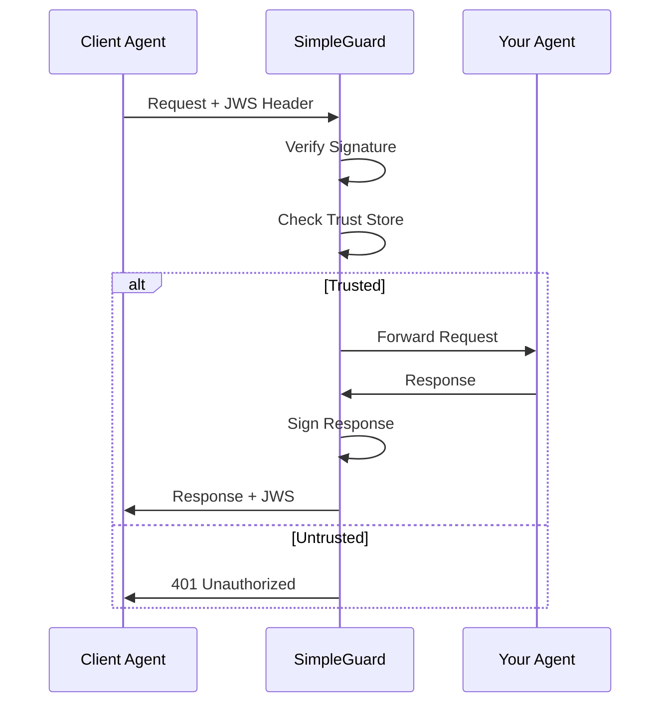

# Step 1: Introduction

In this quickstart, you'll learn how to add security to your A2A agent using the CapiscIO Python SDK. By the end, you'll have cryptographic authentication protecting your agent.

---

## What You'll Build



You'll implement:

- **Identity**: Sign outbound requests with Ed25519 keys
- **Integrity**: Bind signatures to request bodies
- **Replay Protection**: Timestamp-based expiration

---

## Prerequisites

Before starting, ensure you have:

| Requirement | Check |
|-------------|-------|
| Python 3.10+ | `python --version` |
| pip | `pip --version` |
| A FastAPI app (or similar) | Optional - we'll create one |
| ~10 minutes | ☕ |

---

## What is SimpleGuard?

**SimpleGuard** is the "customs officer" for your agent. It:

- **Signs** all outbound requests with your private key
- **Verifies** all inbound requests against your trust store
- **Rejects** requests from unknown or untrusted agents

### Zero Configuration

In development mode, SimpleGuard automatically:

- Generates Ed25519 keypair
- Creates `agent-card.json` with your public key
- Sets up self-trust for local testing

### Production Ready

In production, SimpleGuard:

- Uses your configured private key
- Validates against a curated trust store
- Enforces strict timestamp checking

---

## The Security Model

SimpleGuard implements three security guarantees:

| Guarantee | How It Works |
|-----------|--------------|
| **Identity** | Ed25519 signatures prove who sent the request |
| **Integrity** | Body hash (`bh` claim) proves content wasn't modified |
| **Freshness** | Timestamps (`iat`, `exp`) prevent replay attacks |

### The JWS Token

Every request includes a JWS (JSON Web Signature) header:

```
X-Capiscio-JWS: eyJhbGciOiJFZERTQSIsInR5cCI6IkpXVCIsImtpZCI6ImxvY2FsLWRldi1rZXkifQ...
```

The token contains:

```json
{
  "iss": "did:capiscio:agent:my-agent",
  "iat": 1701432000,
  "exp": 1701432060,
  "bh": "sha256-hash-of-body"
}
```

---

## What You'll Learn

By completing this quickstart, you'll understand:

1. How to install the CapiscIO SDK
2. How to configure SimpleGuard
3. How to sign outbound requests
4. How to verify inbound requests
5. How to manage your trust store

---

## Time Estimate

| Step | Time |
|------|------|
| Installation | 1 min |
| Add SimpleGuard | 2 min |
| Configure Trust | 2 min |
| Test It | 3 min |
| Next Steps | 2 min |
| **Total** | **~10 min** |

---

## Ready?

Let's add cryptographic security to your agent!

<div class="nav-buttons" markdown>
<span></span>
[Continue :material-arrow-right:](2-sdk.md){ .md-button .md-button--primary }
</div>
