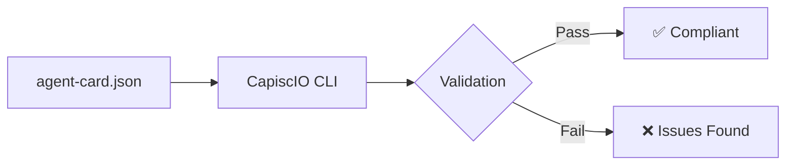

# Step 1: Introduction

In this quickstart, you'll learn how to validate an A2A agent card using the CapiscIO CLI. By the end, you'll be able to check if any agent meets the A2A protocol requirements.

---

## What You'll Build



You'll validate an agent card and receive a detailed report including:

- **Compliance Score** (0-100) — Does it follow the A2A spec?
- **Trust Score** (0-100) — Is it cryptographically signed?
- **Availability Score** (0-100) — Does the endpoint respond correctly?

---

## Prerequisites

Before starting, ensure you have:

| Requirement | Check |
|-------------|-------|
| Node.js 18+ **or** Python 3.10+ | `node --version` or `python --version` |
| A terminal/command line | ✅ |
| 5 minutes of time | ☕ |

---

## What is an Agent Card?

An **Agent Card** is a JSON document that describes an A2A agent. It's like a business card for your AI agent, containing:

- **Identity**: Name, description, version
- **Capabilities**: What the agent can do
- **Endpoints**: Where to reach the agent
- **Skills**: Specific tasks the agent performs

Here's a minimal example:

```json
{
  "name": "My Agent",
  "url": "https://example.com/agent",
  "protocolVersion": "0.2.0"
}
```

CapiscIO validates that your agent card meets the [A2A Protocol Specification](https://github.com/a2aproject/A2A).

---

## What You'll Learn

By completing this quickstart, you'll understand:

1. How to install the CapiscIO CLI
2. How to run your first validation
3. How to interpret validation reports
4. How to fix common validation issues

---

## Time Estimate

| Step | Time |
|------|------|
| Installation | 1 min |
| First Validation | 1 min |
| Understanding Reports | 2 min |
| Next Steps | 1 min |
| **Total** | **~5 min** |

---

## Ready?

Let's install the CLI and validate your first agent!

<div class="nav-buttons" markdown>
<span></span>
[Continue :material-arrow-right:](2-install.md){ .md-button .md-button--primary }
</div>
