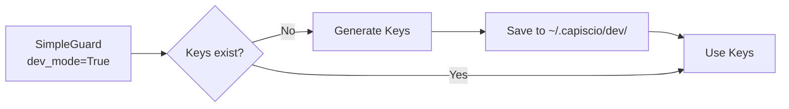

# Dev Mode Security

Use CapiscIO security features during development with auto-generated keys.

---

## Problem

You want to:

- Test security features locally
- Develop without managing real keys
- Have agents talk to each other in development
- Move to production easily

---

## Solution: dev_mode=True

```python
from capiscio_sdk.simple_guard import SimpleGuard

# Auto-generates keys, stores in ~/.capiscio/dev/
guard = SimpleGuard(dev_mode=True)
```

That's it! The guard will:

1. Generate Ed25519 keys on first run
2. Store them in `~/.capiscio/dev/`
3. Use the same keys across restarts
4. Work with other dev-mode guards automatically

---

## How Dev Mode Works



On first run:

```
~/.capiscio/
└── dev/
    ├── private.key     # Your dev private key
    └── public.key      # Your dev public key
```

---

## Multiple Agents in Dev

When running multiple agents locally, they can communicate securely:

```python
# Agent A (port 8000)
from capiscio_sdk.simple_guard import SimpleGuard

guard_a = SimpleGuard(
    dev_mode=True,
    dev_identity="agent-a"  # Unique identity
)

# Agent B (port 8001)  
guard_b = SimpleGuard(
    dev_mode=True,
    dev_identity="agent-b"
)
```

Each gets its own key pair:

```
~/.capiscio/
└── dev/
    ├── agent-a/
    │   ├── private.key
    │   └── public.key
    └── agent-b/
        ├── private.key
        └── public.key
```

---

## Dev Mode Trust

In dev mode, all dev-mode guards automatically trust each other:

```python
# Agent A signs a request
jws = guard_a.sign_outbound(payload, body)

# Agent B can verify it (dev mode auto-trusts)
claims = guard_b.verify_inbound(jws, body)  # Works!
```

This mimics a trust store without the setup.

---

## Transitioning to Production

When ready for production:

1. **Generate real keys:**
   ```bash
   capiscio key gen --out-priv prod-private.key --out-pub prod-public.key
   ```

2. **Set up trust store:**
   ```bash
   mkdir -p ./trusted_keys
   # Add public keys of trusted agents
   cp partner-agent.pub ./trusted_keys/
   ```

3. **Update guard configuration:**
   ```python
   import os
   
   # In production, SimpleGuard finds keys via convention
   # Run from directory containing capiscio_keys/
   guard = SimpleGuard()  # dev_mode=False is default
   
   # Or specify base directory via environment
   guard = SimpleGuard(base_dir=os.environ.get("CAPISCIO_BASE_DIR", "."))
   ```

---

## Environment-Based Configuration

Use environment variables to switch modes:

```python
import os
from capiscio_sdk.simple_guard import SimpleGuard

is_dev = os.environ.get("ENVIRONMENT", "development") == "development"

if is_dev:
    guard = SimpleGuard(dev_mode=True)
else:
    # Production: keys must exist in capiscio_keys/
    base_dir = os.environ.get("CAPISCIO_BASE_DIR", ".")
    guard = SimpleGuard(base_dir=base_dir)
```

---

## Common Patterns

### Local Docker Compose

```yaml title="docker-compose.yml"
services:
  agent-a:
    build: ./agent-a
    environment:
      - CAPISCIO_DEV_MODE=true
      - CAPISCIO_DEV_IDENTITY=agent-a
    volumes:
      - capiscio-dev:/root/.capiscio/dev
  
  agent-b:
    build: ./agent-b
    environment:
      - CAPISCIO_DEV_MODE=true
      - CAPISCIO_DEV_IDENTITY=agent-b
    volumes:
      - capiscio-dev:/root/.capiscio/dev

volumes:
  capiscio-dev:  # Shared volume for dev keys
```

### Test Fixtures

```python
import pytest
from capiscio_sdk.simple_guard import SimpleGuard

@pytest.fixture
def guard():
    """Fresh dev guard for each test."""
    return SimpleGuard(dev_mode=True)

@pytest.fixture
def signed_request(guard):
    """Create a pre-signed request for testing."""
    body = b'{"test": "data"}'
    payload = {"iss": "test-agent", "sub": "your-agent"}
    jws = guard.sign_outbound(payload, body)
    return {"jws": jws, "body": body}

def test_verification(guard, signed_request):
    claims = guard.verify_inbound(
        signed_request["jws"],
        signed_request["body"]
    )
    assert claims["iss"] == "test-agent"
```

---

## Warnings

!!! warning "Never use dev_mode in production"
    
    Dev mode:
    
    - Auto-trusts all dev keys (no real authentication)
    - Stores keys in predictable locations
    - Doesn't enforce key management policies
    
    Always set `dev_mode=False` in production.

!!! tip "Clean dev keys periodically"
    
    ```bash
    rm -rf ~/.capiscio/dev/
    ```
    
    This forces key regeneration, useful when testing fresh setups.

---

## See Also

- [Security Quickstart](../../quickstarts/secure/1-intro.md) — Full walkthrough
- [Key Rotation](key-rotation.md) — Manage production keys
- [Trust Store Setup](trust-store.md) — Configure trust relationships
