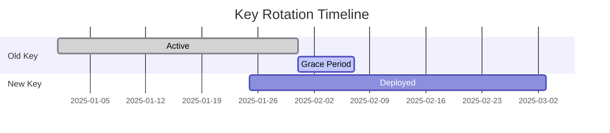

# Key Rotation

Rotate your Ed25519 keys safely without breaking existing integrations.

---

## Problem

You need to rotate keys because:

- Security policy requires periodic rotation
- Key may have been compromised
- Employee with key access left the company
- Upgrading to stronger key management

---

## Solution: Overlapping Key Validity

The safest approach is to have a transition period where both old and new keys are valid:



---

## Step 1: Generate New Key

```bash
# Generate new keypair with dated identifier
capiscio key gen \
  --out-priv capiscio_keys/private-2025-02.pem \
  --out-pub capiscio_keys/public-2025-02.pem
```

---

## Step 2: Update Agent Card with Both Keys

Add the new key to your `agent-card.json` while keeping the old one:

```json title="agent-card.json"
{
  "name": "My Agent",
  "public_keys": [
    {
      "kty": "OKP",
      "crv": "Ed25519",
      "x": "NEW_KEY_BASE64",
      "kid": "key-2025-02",
      "use": "sig"
    },
    {
      "kty": "OKP",
      "crv": "Ed25519",
      "x": "OLD_KEY_BASE64",
      "kid": "key-2025-01",
      "use": "sig"
    }
  ]
}
```

---

## Step 3: Deploy New Agent Card

Deploy the updated agent card. Partners can now verify signatures from either key.

```bash
# Deploy to production
kubectl apply -f agent-deployment.yaml

# Or update your hosting
cp agent-card.json /var/www/.well-known/agent-card.json
```

---

## Step 4: Switch to New Key for Signing

Update your keys and agent-card.json to use the new key:

```bash
# 1. Replace the private key
mv capiscio_keys/private.pem capiscio_keys/private-old.pem
cp capiscio_keys/private-2025-02.pem capiscio_keys/private.pem

# 2. Update your agent-card.json with the new public key
# (You'll need to regenerate or update the public_keys array)
```

Then restart your agent. SimpleGuard will automatically use the new key:

```python
from capiscio_sdk.simple_guard import SimpleGuard

# SimpleGuard finds keys at capiscio_keys/private.pem by convention
guard = SimpleGuard()  # Uses the new key automatically
```

Deploy this change. Your agent now signs with the new key.

---

## Step 5: Notify Partners

Give partners time to update their trust stores:

```markdown
Subject: CapiscIO Key Rotation Notice

We are rotating our signing key on [DATE].

**Action Required:**
1. Add our new public key to your trust store before [DATE]
2. Old key will be removed on [DATE + 7 days]

New key ID: key-2025-02
New public key: [attached or link to agent-card.json]
```

---

## Step 6: Remove Old Key

After the grace period, remove the old key from your agent card:

```json title="agent-card.json"
{
  "public_keys": [
    {
      "kty": "OKP",
      "crv": "Ed25519",
      "x": "NEW_KEY_BASE64",
      "kid": "key-2025-02",
      "use": "sig"
    }
  ]
}
```

And securely delete the old private key:

```bash
# Securely delete old key
shred -u capiscio_keys/private-2025-01.pem
# Or on macOS
rm -P capiscio_keys/private-2025-01.pem
```

---

## Automated Rotation Script

```bash
#!/bin/bash
# rotate-keys.sh

set -e

NEW_KEY_ID="key-$(date +%Y-%m)"
KEYS_DIR="capiscio_keys"

echo "🔑 Generating new key: $NEW_KEY_ID"
capiscio key gen \
  --out-priv "$KEYS_DIR/private-$NEW_KEY_ID.pem" \
  --out-pub "$KEYS_DIR/public-$NEW_KEY_ID.pem"

echo "📝 Update agent-card.json with the new key"
echo "   Key ID: $NEW_KEY_ID"
echo "   Public key: $KEYS_DIR/public-$NEW_KEY_ID.pem"

echo ""
echo "⚠️  Next steps:"
echo "1. Add new key to agent-card.json (keep old key)"
echo "2. Deploy updated agent card"
echo "3. Update CAPISCIO_PRIVATE_KEY env var to new key"
echo "4. Deploy application"
echo "5. After 7 days, remove old key from agent card"
echo "6. Securely delete old private key"
```

---

## Emergency Rotation (Key Compromised)

If a key is compromised, skip the grace period:

```bash
#!/bin/bash
# emergency-rotate.sh

set -e

echo "🚨 EMERGENCY KEY ROTATION"

# 1. Generate new key immediately
NEW_KEY_ID="key-emergency-$(date +%Y%m%d%H%M)"
capiscio key gen \
  --out-priv "capiscio_keys/private-$NEW_KEY_ID.pem" \
  --out-pub "capiscio_keys/public-$NEW_KEY_ID.pem"

# 2. Update agent card with ONLY new key (remove old immediately)
echo "Update agent-card.json with ONLY the new key"
echo "Remove the compromised key immediately!"

# 3. Notify partners urgently
echo ""
echo "📧 URGENT: Notify all partners to update their trust stores NOW"
echo "   Old key should be untrusted immediately"
```

---

## Best Practices

| Practice | Recommendation |
|----------|----------------|
| Rotation frequency | Every 90 days minimum |
| Grace period | 7-14 days |
| Key naming | Include date: `key-2025-02` |
| Storage | Use secrets manager in production |
| Backup | Keep encrypted backup of current key |
| Audit | Log all key rotation events |

---

## See Also

- [Trust Store Setup](trust-store.md) — Configure which keys to trust
- [Dev Mode Security](dev-mode.md) — Development key handling
- [Security Quickstart](../../quickstarts/secure/1-intro.md) — Full security setup
