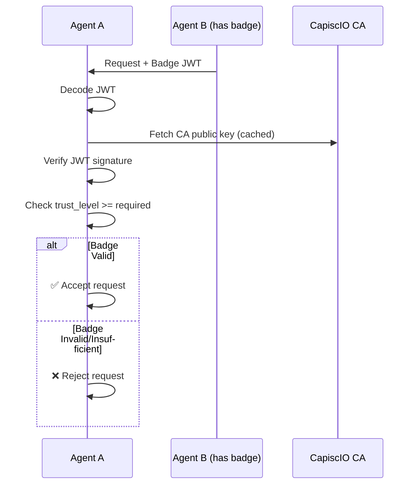

# 🏅 Trust Badges

> **Verifiable trust credentials for AI agents — Like SSL certificates, but for the agent economy.**

## The Trust Problem

When Agent A receives a request from Agent B, how does it know:

- Is this really Agent B?
- Can I trust Agent B?
- Who vouches for Agent B?

**Self-attestation isn't enough.** Anyone can claim to be anyone.

---

## The Solution: Trust Badges

CapiscIO issues **Trust Badges** — cryptographically signed credentials that prove an agent's identity has been verified to a specific level.

```
┌─────────────────────────────────────────────────────────────┐
│                      TRUST BADGE                            │
├─────────────────────────────────────────────────────────────┤
│  Subject: did:web:registry.capisc.io:agents:acme-bot       │
│  Level:   3 (Organization Validated)                        │
│  IAL:     1 (Proof of Possession)                          │
│  Issuer:  https://registry.capisc.io                       │
│  TTL:     5 minutes                                         │
│  ──────────────────────────────────────────────────────────│
│  ✓ Domain ownership verified                                │
│  ✓ Organization identity confirmed                         │
│  ✓ Key binding cryptographically proven                    │
└─────────────────────────────────────────────────────────────┘
```

!!! info "Short-lived by Design"
    Badges have a default TTL of 5 minutes, not months or years like SSL certificates. This limits exposure if a badge is intercepted and ensures each request proves current identity.

---

## Trust Levels Explained

| Level | Name | Verification | Best For |
|:-----:|------|--------------|----------|
| **0** | Self-Signed (SS) | None — agent self-signs with `did:key` | Development, testing |
| **1** | Registered (REG) | Account registration with Registry | Internal agents, early dev |
| **2** | Domain Validated (DV) | DNS TXT or HTTP challenge | Production B2B APIs |
| **3** | Organization Validated (OV) | DV + legal entity check | High-trust enterprise |
| **4** | Extended Validation (EV) | OV + manual security audit | Regulated industries |

### Visual Comparison

```
Trust Level    What It Proves              Effort      Use Case
───────────    ──────────────              ──────      ────────
    0          "I generated a keypair"     Instant     🧪 Testing
    1          "I have a Registry account" 5 min       🔧 Internal
    2          "I control this domain"     10 min      🏢 Production  
    3          "I am this organization"    1-5 days    🏛️ Enterprise
    4          "I've been audited"         Weeks       🏦 Regulated
```

!!! warning "Level 0 in Production"
    Level 0 (self-signed) badges are for **development only**. Production verifiers should reject Level 0 by default. Use `--accept-self-signed` (CLI) or `accept_self_signed=True` (SDK) to opt in during testing.

---

## Get Your First Badge in 5 Minutes

### Level 0: Self-Signed (Instant)

```bash
capiscio key gen
```

No registration needed. You immediately get a `did:key` identity at Trust Level 0.

### Level 1: Domain Validated

```bash
# Domain Validated badges require registration with CapiscIO Registry
capiscio badge request --did did:web:example.com:agents:myagent --key ./private.jwk --ca https://registry.capisc.io --api-key YOUR_API_KEY
```

For production trust, you'll need domain validation.

### Level 2: Organization Validated

```bash
capiscio badge request --level 2 --domain example.com
```

CapiscIO will ask you to:
1. Add a DNS TXT record, **or**
2. Place a file at `/.well-known/capiscio-challenge`

```
✅ Domain verified!

Badge issued:
  Level: 2 (Domain Validated)
  Subject: did:web:registry.capisc.io:agents:your-agent
  Expires: 2026-12-11
  
Saved to: ./capiscio_keys/badge.jwt
```

### Levels 3-4: Organization/Extended Validation

These require manual review. Start the process:

```bash
capiscio badge request --level 3
```

You'll be guided through:
- Business registration documents
- Domain ownership proof
- Legal entity verification

---

## How Badges Work

### Badge Structure (RFC-002 §4.3)

Badges are JWS (JSON Web Signature) tokens signed by the CapiscIO Badge CA:

```json
{
  "header": {
    "alg": "EdDSA",
    "typ": "JWT",
    "kid": "ca-key-2025-01"
  },
  "payload": {
    "jti": "550e8400-e29b-41d4-a716-446655440000",
    "iss": "https://registry.capisc.io",
    "sub": "did:web:registry.capisc.io:agents:acme-bot",
    "iat": 1733788800,
    "exp": 1733789100,
    "ial": "1",
    "key": {
      "kty": "OKP",
      "crv": "Ed25519",
      "x": "base64url-encoded-public-key"
    },
    "vc": {
      "type": ["VerifiableCredential", "AgentIdentity"],
      "credentialSubject": {
        "domain": "acme.com",
        "level": "3"
      }
    },
    "cnf": {
      "kid": "did:web:registry.capisc.io:agents:acme-bot#key-1"
    }
  }
}
```

**Key Claims:**

| Claim | Description |
|-------|-------------|
| `jti` | Badge ID (UUID) for revocation and audit |
| `iss` | Issuer (CA URL for levels 1-4, `did:key` for level 0) |
| `sub` | Agent's DID identity |
| `exp` | Expiration (default: 5 minutes from `iat`) |
| `ial` | Identity Assurance Level (`"0"` or `"1"`) |
| `key` | Agent's public key (JWK) — for signature verification |
| `vc.credentialSubject.level` | Trust level (`"0"` to `"4"`) |
| `cnf` | Confirmation key (present only for IAL-1 badges) |

!!! note "Trust levels are strings"
    Per RFC-002 §3, `level` MUST be a string (`"0"` through `"4"`), not an integer. This avoids bugs where `0` might be falsy in some languages.
```

### Verification Flow



---

## Enforce Trust Levels

### In Your Agent (Python SDK)

```python
from capiscio_sdk import SimpleGuard

# Require at least Level 2 for production
guard = SimpleGuard(
    min_trust_level=2,
    badge_path="./capiscio_keys/badge.jwt"
)

# Requests from Level 0-1 agents will be rejected
```

### In the CLI

```bash
# Validate and check trust level
capiscio validate agent-card.json --min-trust-level 2

# Verify a specific badge
capiscio badge verify ./badge.jwt
```

### Trust Level Policies

Define different requirements for different operations:

```python
guard = SimpleGuard(
    trust_policies={
        "read": 0,      # Anyone can read
        "write": 2,     # Domain-validated for writes
        "admin": 3,     # Org-validated for admin
    }
)
```

---

## Badge Lifecycle

```
Key Gen → Registration → Verification → Badge Request → Use → Request Again
    │          │              │              │           │          │
    ▼          ▼              ▼              ▼           ▼          ▼
 Generate   Register      Prove domain   CA signs    Attach to  Badges expire
 Ed25519    with CA       (DV+) or org   5min JWT    requests   after 5 min
```

!!! note "Badge Flow vs SSL Certificate Flow"
    Unlike SSL certificates where you get a certificate once and use it for months, badges are requested frequently (before each session or batch of requests). This is closer to OAuth access tokens than SSL certificates.

### Requesting New Badges

Badges are short-lived, so you'll request them often:

```bash
# Request a fresh badge (use cached key)
capiscio badge request --did did:web:example.com:agents:myagent \
  --key ./private.jwk --ca https://registry.capisc.io
```

The SDK handles this automatically when configured with CA credentials.

### Revocation

If a key is compromised, revoke immediately via the CapiscIO Registry API:

```bash
curl -X POST "https://registry.capisc.io/v1/badges/revoke" \
  -H "X-Capiscio-Registry-Key: YOUR_API_KEY" \
  -d '{"jti": "BADGE_JTI", "reason": "key_compromise"}'
```

Revoked badges are rejected immediately. The short TTL (5 minutes) also limits exposure—even without revocation, a stolen badge becomes useless quickly.

---

## Comparison to SSL/TLS

| Aspect | SSL Certificates | CapiscIO Badges |
|--------|-----------------|-----------------|
| **Protects** | Web traffic (HTTPS) | Agent communication |
| **Identifier** | Domain name | Agent DID |
| **Levels** | DV, OV, EV | 0, 1, 2, 3, 4 |
| **Issuer** | CAs (DigiCert, Let's Encrypt) | CapiscIO Badge CA |
| **Format** | X.509 | JWS (JWT) |
| **Lifetime** | 90 days – 1 year | **5 minutes** (short-lived) |
| **Verification** | Browser built-in | CapiscIO SDK/CLI |

**Similar trust model, different lifetime model.** Badges use the same trust level hierarchy (DV, OV, EV) but are short-lived tokens refreshed frequently, not long-lived certificates.

---

## Developer Experience

### Attach Badge to Requests (Automatic)

```python
from capiscio_sdk import SimpleGuard

guard = SimpleGuard(badge_path="./capiscio_keys/badge.jwt")

# Badge automatically attached to outbound requests
async with guard.client() as client:
    response = await client.post(
        "https://other-agent.com/task",
        json={"task": "weather"}
    )
```

### Verify Inbound Badge (Automatic)

```python
@app.post("/task")
@guard.protect  # Verifies badge automatically
async def handle_task(request: A2ARequest):
    # request.sender_trust_level available
    if request.sender_trust_level >= 2:
        return process_sensitive_task(request)
    return {"error": "Insufficient trust level"}
```

---

## Next Steps

<div class="grid cards" markdown>

-   :material-account-plus:{ .lg .middle } **Register Your Agent**

    ---

    Get a DID and request your first badge.

    [:octicons-arrow-right-24: Agent Registry](../registry/index.md)

-   :material-shield-check:{ .lg .middle } **Enforcement Guide**

    ---

    Configure trust level requirements.

    [:octicons-arrow-right-24: Enforcement](../concepts/enforcement.md)

-   :material-certificate:{ .lg .middle } **Badge CA Details**

    ---

    Technical reference for the Certificate Authority.

    [:octicons-arrow-right-24: Badge CA Reference](../reference/server/badge-ca.md)

-   :material-frequently-asked-questions:{ .lg .middle } **Trust FAQ**

    ---

    Common questions about badges and trust levels.

    [:octicons-arrow-right-24: FAQ](#faq)

</div>

---

## FAQ

??? question "How much do badges cost?"
    
    - **Level 0-1**: Free forever
    - **Level 2 (DV)**: Free (like Let's Encrypt)
    - **Level 3-4 (OV/EV)**: Pricing TBD — manual verification required

??? question "How long do badges last?"
    
    Badges are **short-lived tokens** by design (RFC-002 §4.3.1):
    
    - **Default TTL**: 5 minutes
    - **Maximum TTL**: Configurable by CA, typically up to 1 hour
    
    This is intentional security design—badges prove identity at request time, not for long periods. Agents request fresh badges as needed via the CLI or SDK.
    
    !!! note "Not like SSL certificates"
        Unlike SSL certificates that last months or years, badges are ephemeral. Think of them like short-lived access tokens, not long-term credentials.

??? question "What's the difference between Trust Level and IAL?"
    
    These are two different dimensions of badge assurance (RFC-002 §5, §7.2.1):
    
    | Dimension | What It Measures | Values |
    |-----------|------------------|--------|
    | **Trust Level** | Validation rigor during registration | 0-4 (SS, REG, DV, OV, EV) |
    | **IAL** (Identity Assurance Level) | Key binding assurance at issuance | 0 (account-attested) or 1 (proof-of-possession) |
    
    - **IAL-0**: "The account holder requested a badge for this agent DID"
    - **IAL-1**: "The requester cryptographically proved they control the private key" (via PoP protocol, RFC-003)
    
    Level 0 badges are always IAL-0. Levels 1-4 can be IAL-0 or IAL-1.

??? question "What if my key is compromised?"
    
    1. Immediately revoke via Registry API
    2. Generate new keypair: `capiscio key gen`
    3. Request new badge: `capiscio badge request`
    
    Revoked badges are rejected within minutes. The short badge TTL (5 minutes default) limits exposure even before revocation propagates.

??? question "Can I run my own Badge CA?"
    
    Yes! For enterprise deployments, you can run `capiscio-server` as your own CA. See [Enterprise Deployment](../reference/server/deployment.md).

??? question "Why are badges so short-lived?"
    
    Short-lived badges provide several security benefits:
    
    - **Limits exposure**: A stolen badge is only valid for minutes
    - **Fresh identity**: Each request proves current key control
    - **Simpler revocation**: Short TTL means less reliance on revocation lists
    - **Audit trail**: Each badge issuance is logged
    
    This follows the same pattern as OAuth access tokens—short-lived credentials that are refreshed as needed.
