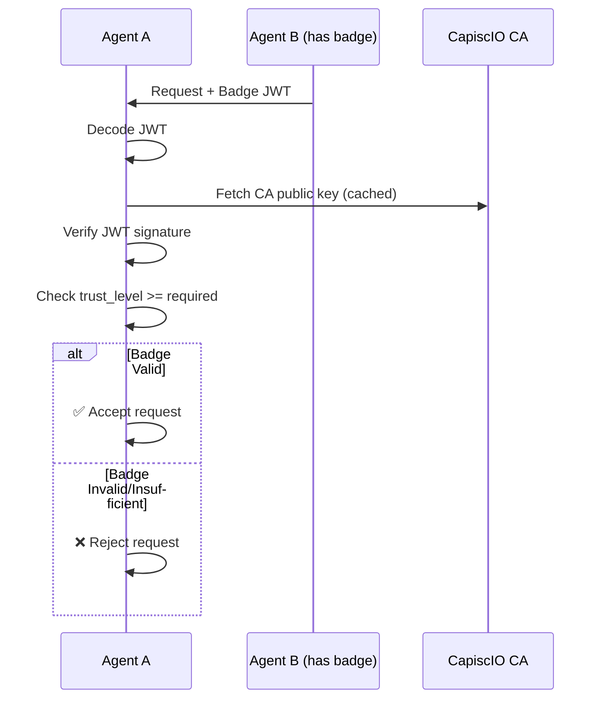

# 🏅 Trust Badges

> **Verifiable trust credentials for AI agents — Like SSL certificates, but for the agent economy.**

## The Trust Problem

When Agent A receives a request from Agent B, how does it know:

- Is this really Agent B?
- Can I trust Agent B?
- Who vouches for Agent B?

**Self-attestation isn't enough.** Anyone can claim to be anyone.

---

## The Solution: Trust Badges

CapiscIO issues **Trust Badges** — cryptographically signed credentials that prove an agent's identity has been verified to a specific level.

```
┌─────────────────────────────────────────────────────────────┐
│                      TRUST BADGE                            │
├─────────────────────────────────────────────────────────────┤
│  Subject: did:web:registry.capisc.io:agents:acme-bot       │
│  Level:   3 (Organization Validated)                        │
│  Issuer:  CapiscIO Badge CA                                │
│  Expires: 2026-12-11                                        │
│  ──────────────────────────────────────────────────────────│
│  ✓ Domain ownership verified                                │
│  ✓ Organization identity confirmed                         │
│  ✓ Legal entity validated                                  │
└─────────────────────────────────────────────────────────────┘
```

---

## Trust Levels Explained

| Level | Name | Verification | Best For |
|:-----:|------|--------------|----------|
| **0** | Self-Signed | None — `did:key` only | Development, testing |
| **1** | Registered (REG) | Email verification | Personal projects |
| **2** | Domain Validated (DV) | DNS/HTTP challenge | Production APIs |
| **3** | Organization Validated (OV) | Legal entity check | Enterprise |
| **4** | Extended Validation (EV) | Full audit + compliance | Financial, healthcare |

### Visual Comparison

```
Trust Level    What It Proves              Effort      Use Case
───────────    ──────────────              ──────      ────────
    0          "I generated a keypair"     Instant     🧪 Testing
    1          "I own this email"          5 min       👤 Personal
    2          "I control this domain"     10 min      🏢 Production  
    3          "I am this organization"    1-5 days    🏛️ Enterprise
    4          "I've been audited"         Weeks       🏦 Regulated
```

---

## Get Your First Badge in 5 Minutes

### Level 0: Self-Signed (Instant)

```bash
capiscio keygen
```

No registration needed. You immediately get a `did:key` identity at Trust Level 0.

### Level 1: Registered

```bash
capiscio register --email you@example.com
# Check your email for verification link
```

### Level 2: Domain Validated

```bash
capiscio badge request --level 2 --domain example.com
```

CapiscIO will ask you to:
1. Add a DNS TXT record, **or**
2. Place a file at `/.well-known/capiscio-challenge`

```
✅ Domain verified!

Badge issued:
  Level: 2 (Domain Validated)
  Subject: did:web:registry.capisc.io:agents:your-agent
  Expires: 2026-12-11
  
Saved to: ./capiscio_keys/badge.jwt
```

### Levels 3-4: Organization/Extended Validation

These require manual review. Start the process:

```bash
capiscio badge request --level 3
```

You'll be guided through:
- Business registration documents
- Domain ownership proof
- Legal entity verification

---

## How Badges Work

### Badge Structure (JWT)

Badges are standard JWTs signed by the CapiscIO Badge CA:

```json
{
  "header": {
    "alg": "EdDSA",
    "typ": "JWT",
    "kid": "capiscio-ca-2025"
  },
  "payload": {
    "iss": "https://ca.capisc.io",
    "sub": "did:web:registry.capisc.io:agents:acme-bot",
    "iat": 1733961600,
    "exp": 1765497600,
    "capiscio": {
      "trust_level": 3,
      "level_name": "organization_validated",
      "verifications": [
        "email_verified",
        "domain_validated", 
        "org_validated"
      ],
      "org": {
        "name": "ACME Corporation",
        "country": "US",
        "registration_id": "12-3456789"
      }
    }
  }
}
```

### Verification Flow



---

## Enforce Trust Levels

### In Your Agent (Python SDK)

```python
from capiscio_sdk import SimpleGuard

# Require at least Level 2 for production
guard = SimpleGuard(
    min_trust_level=2,
    badge_path="./capiscio_keys/badge.jwt"
)

# Requests from Level 0-1 agents will be rejected
```

### In the CLI

```bash
# Validate and check trust level
capiscio validate agent-card.json --min-trust-level 2

# Verify a specific badge
capiscio badge verify ./badge.jwt
```

### Trust Level Policies

Define different requirements for different operations:

```python
guard = SimpleGuard(
    trust_policies={
        "read": 0,      # Anyone can read
        "write": 2,     # Domain-validated for writes
        "admin": 3,     # Org-validated for admin
    }
)
```

---

## Badge Lifecycle

```
Request → Verification → Issuance → Active → Renewal/Expiry
    │          │             │         │           │
    ▼          ▼             ▼         ▼           ▼
 Submit    Prove domain   Badge CA   Use in    Re-verify
 details   or org ID      signs JWT  requests  annually
```

### Renewal

Badges expire (typically 1 year). Renew before expiry:

```bash
capiscio badge renew
```

### Revocation

If a key is compromised, revoke immediately:

```bash
capiscio badge revoke --reason key_compromise
```

Revoked badges are published to a revocation list checked during verification.

---

## Comparison to SSL/TLS

| Aspect | SSL Certificates | CapiscIO Badges |
|--------|-----------------|-----------------|
| **Protects** | Web traffic (HTTPS) | Agent communication |
| **Identifier** | Domain name | Agent DID |
| **Levels** | DV, OV, EV | 0, 1, 2, 3, 4 |
| **Issuer** | CAs (DigiCert, Let's Encrypt) | CapiscIO Badge CA |
| **Format** | X.509 | JWT |
| **Verification** | Browser built-in | CapiscIO SDK/CLI |

**Familiar model, new domain.** If you understand SSL certificates, you understand Trust Badges.

---

## Developer Experience

### Attach Badge to Requests (Automatic)

```python
from capiscio_sdk import SimpleGuard

guard = SimpleGuard(badge_path="./capiscio_keys/badge.jwt")

# Badge automatically attached to outbound requests
async with guard.client() as client:
    response = await client.post(
        "https://other-agent.com/task",
        json={"task": "weather"}
    )
```

### Verify Inbound Badge (Automatic)

```python
@app.post("/task")
@guard.protect  # Verifies badge automatically
async def handle_task(request: A2ARequest):
    # request.sender_trust_level available
    if request.sender_trust_level >= 2:
        return process_sensitive_task(request)
    return {"error": "Insufficient trust level"}
```

---

## Next Steps

<div class="grid cards" markdown>

-   :material-account-plus:{ .lg .middle } **Register Your Agent**

    ---

    Get a DID and request your first badge.

    [:octicons-arrow-right-24: Agent Registry](../registry/index.md)

-   :material-shield-check:{ .lg .middle } **Enforcement Guide**

    ---

    Configure trust level requirements.

    [:octicons-arrow-right-24: Enforcement](../concepts/enforcement.md)

-   :material-certificate:{ .lg .middle } **Badge CA Details**

    ---

    Technical reference for the Certificate Authority.

    [:octicons-arrow-right-24: Badge CA Reference](../reference/server/badge-ca.md)

-   :material-frequently-asked-questions:{ .lg .middle } **Trust FAQ**

    ---

    Common questions about badges and trust levels.

    [:octicons-arrow-right-24: FAQ](#faq)

</div>

---

## FAQ

??? question "How much do badges cost?"
    
    - **Level 0-1**: Free forever
    - **Level 2 (DV)**: Free (like Let's Encrypt)
    - **Level 3-4 (OV/EV)**: Pricing TBD — manual verification required

??? question "How long do badges last?"
    
    - Level 0: No expiry (self-signed)
    - Level 1-2: 1 year
    - Level 3-4: 1 year (with annual re-verification)

??? question "What if my key is compromised?"
    
    1. Immediately revoke: `capiscio badge revoke --reason key_compromise`
    2. Generate new keypair: `capiscio keygen`
    3. Request new badge: `capiscio badge request`
    
    Revoked badges are rejected within minutes.

??? question "Can I run my own Badge CA?"
    
    Yes! For enterprise deployments, you can run `capiscio-server` as your own CA. See [Enterprise Deployment](../reference/server/deployment.md).
